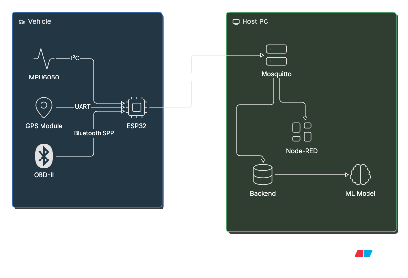
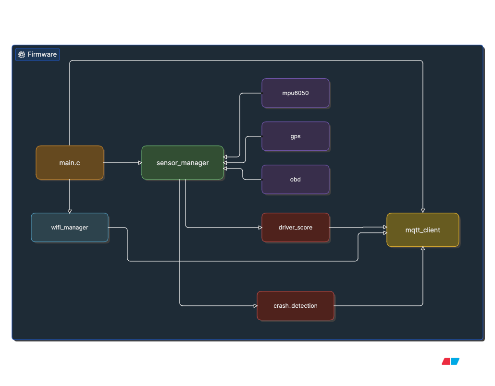
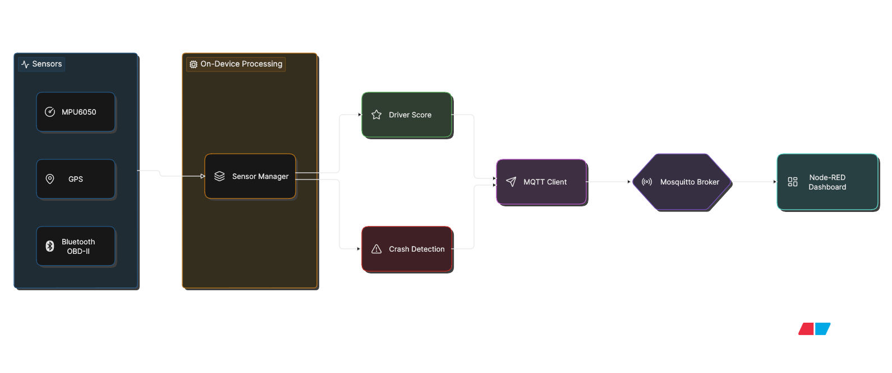
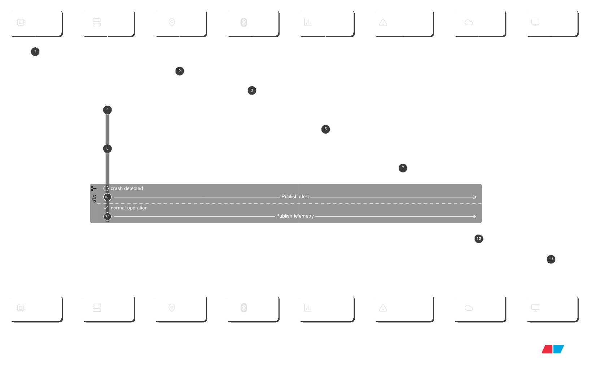

# Driver Behaviour Analysis System


## Project Overview

The Driver Behaviour Analysis System is an embedded IoT project designed to monitor and evaluate driver safety using an ESP32. It collects real-time data from onboard sensors such as the IMU, GPS, and optional OBD-II interface to detect unsafe driving events, calculate a driver safety score, and publish telemetry over MQTT for real-time visualization on a dashboard.

---

## Features

- **Real-Time Telemetry**: Collects data from IMU, GPS, and optional OBD-II sensors.
- **Driver Scoring**: Calculates a safety score based on driving behaviour such as harsh braking, acceleration, and cornering.
- **Crash Detection**: Detects severe impact events using acceleration thresholds.
- **Geo-fencing**: Monitors entry/exit from predefined zones.
- **MQTT Communication**: Publishes telemetry and driver statistics in real time.
- **Dashboard**: Visualizes telemetry and driver scores through a React/Vite dashboard (dbas-dashboard) included in this repository.
- **Alerts**: Publishes safety alerts for geofence violations, crashes, and idling; these are shown in the dashboard Recent Alerts panel.
- **Modular Firmware**: Organized into independent drivers and FreeRTOS tasks for easy maintenance and scalability.

---

## Tech Stack

| Component | Technology |
|-------------------|--------------------|
| Firmware | ESP32, ESP-IDF, FreeRTOS |
| Language | C |
| Communication | MQTT |
| Sensors | MPU6050, GPS, Optional OBD-II |
| Dashboard | React |

---

## System Architecture

The system consists of an ESP32-based firmware that interfaces with vehicle sensors, processes driver behaviour locally, and publishes telemetry over MQTT. The published data can be visualized using a Node-RED dashboard for real-time monitoring.



--

## Folder Structure

- **firmware/**: ESP32 firmware, drivers, and application logic.
- **backend/**: Supporting backend services for telemetry processing and integration.
- **ML/**: Experimental machine learning models and datasets for driver behaviour analysis.
- **dbas-dashboard/**: React/Vite dashboard for real-time visualization (open-source React app in dbas-dashboard).
- **docs/**: Project documentation.



---

## How It Works

1. **Data Collection**: The ESP32 continuously reads data from the IMU, GPS, and optional OBD-II interface.
2. **Data Processing**: FreeRTOS tasks process sensor data to detect unsafe driving events and calculate a driver safety score.
3. **Data Transmission**: Processed telemetry is published to an MQTT broker over Wi-Fi.
4. **Visualization**: The React dashboard subscribes to MQTT topics and displays real-time telemetry and driver statistics.




---

## Hardware Requirements

- **ESP32 Development Board**: Main processing unit.
- **MPU6050**: Accelerometer and gyroscope sensor.
- **GPS Module**: Vehicle location and speed tracking.
- **OBD-II Adapter (Optional)**: Vehicle diagnostic information.
- **Wi-Fi Connectivity**: MQTT communication.

---

## Getting Started

### Prerequisites

- ESP-IDF v5.x (5.4.4)
- Node.js and npm (for the React dashboard)
- MQTT Broker (e.g., Mosquitto)

### Installation

1. Clone the repository:
   ```bash
   git clone https://github.com/your-username/Driver-Behaviour-Analysis.git
   cd Driver-Behaviour-Analysis/firmware/DBAS
   ```

2. Configure the firmware:
   - Update the Wi‑Fi credentials, OBD-II MAC (if used), and MQTT broker settings in `config.h`.
   - Add or edit geofence zones in `app_main.c` as needed.

3. Build and flash the firmware:
   ```bash
   idf.py build
   idf.py -p <PORT> flash monitor
   ```

4. Frontend dashboard (React/Vite):
   - The dashboard application is in `dbas-dashboard/`.
   - Development (hot-reload):
     ```bash
     cd ../../dbas-dashboard
     npm install
     npm run dev
     ```
   - Production build:
     ```bash
     npm run build
     ```

5. Start an MQTT broker (e.g., Mosquitto):
   -  `mosquitto.conf` settings:
     - listener 1883
     - allow_anonymous true
   - Run on Windows (example):
     ```cmd
     "C:\Program Files\Mosquitto\mosquitto.exe" -c "C:\Program Files\Mosquitto\mosquitto.conf" -v
     ```
   - To monitor all MQTT traffic for debugging:
     ```cmd
     "C:\Program Files\mosquitto\mosquitto_sub.exe" -h localhost -t "fleet/#" -v
     ```

---
6. Notes and troubleshooting

- If the dashboard appears blank in development, open the browser console to check for missing icon/component import errors (ShieldCheckIcon errors were fixed in recent updates).
- To reset dashboard data, delete or move the backend SQLite database (`backend/dbas.db`) and restart the backend; this will clear stored telemetry and scores.
- The experimental LED indicator module was added and then removed — no LED-related build configuration is required.
- Raw NMEA GPS sentence logging was reverted; enable it manually in `gps.c` if you need to debug GPS sentence contents.


---

## License

This project is licensed under the MIT License.
