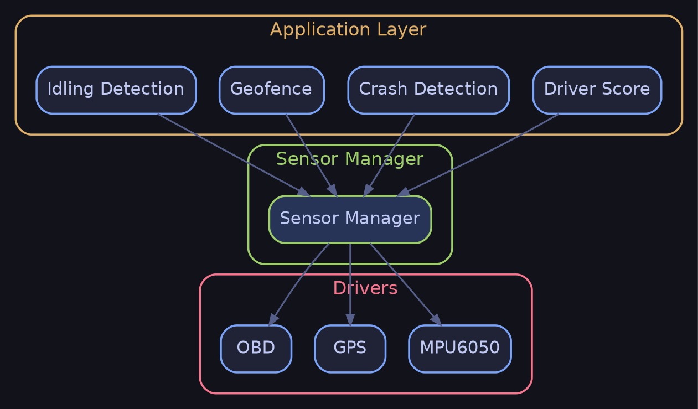
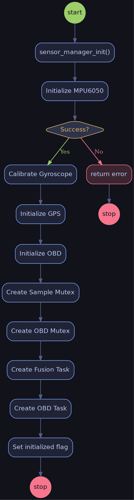
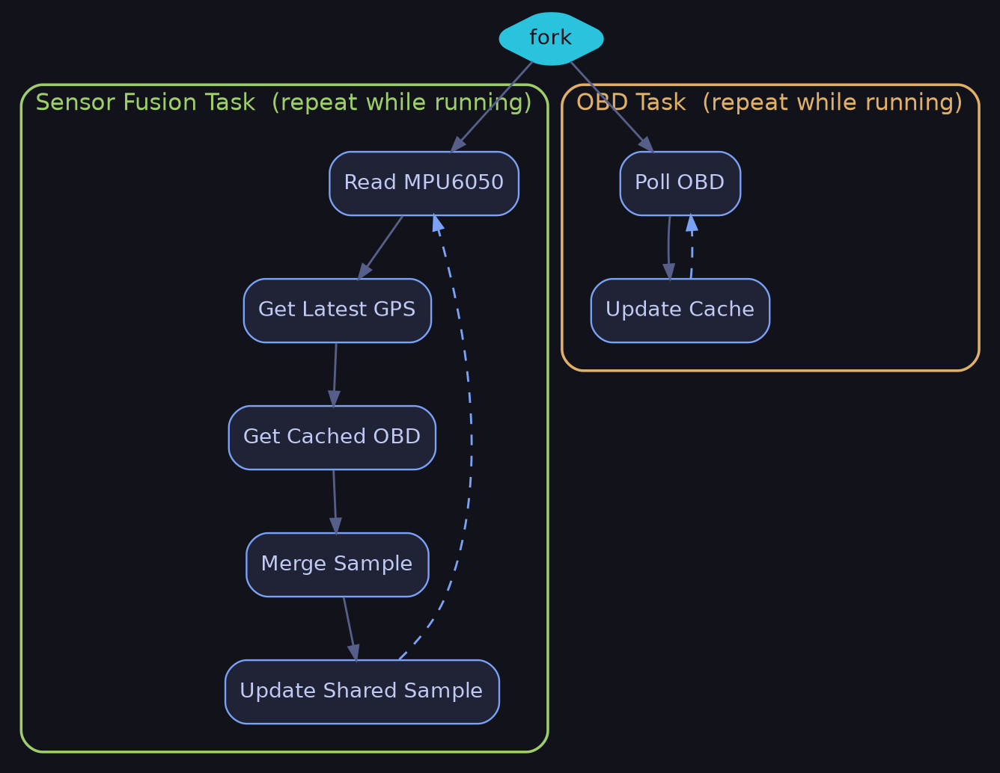
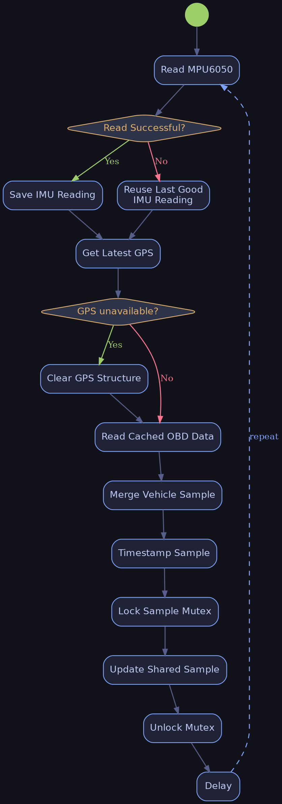
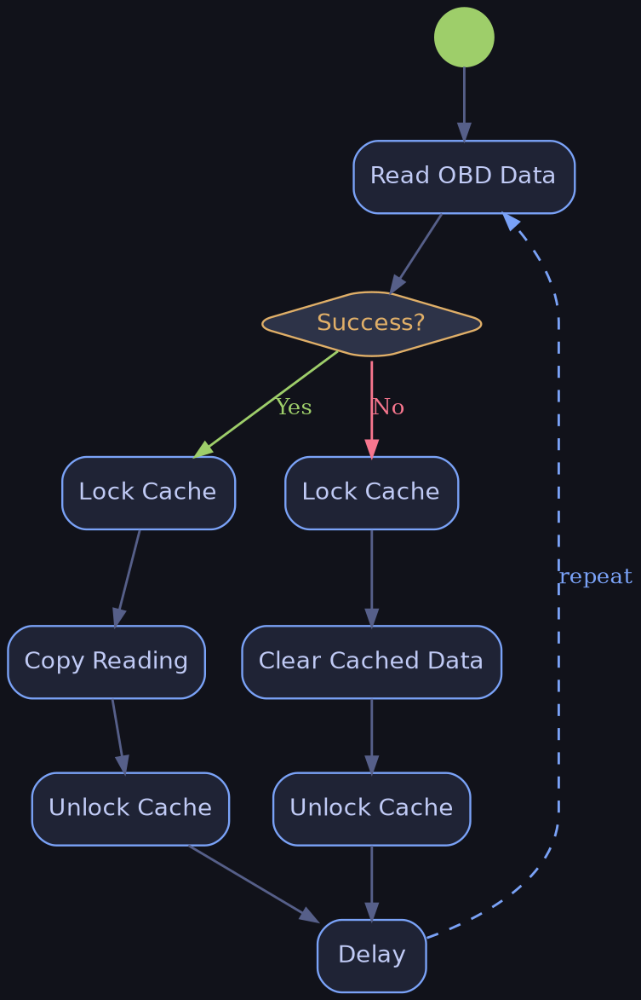
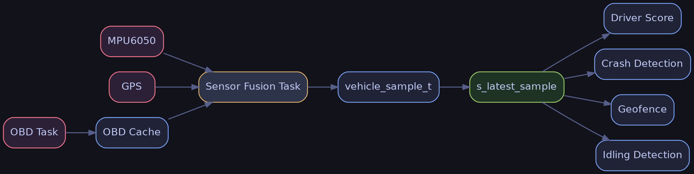

# Sensor Manager Module

> **Purpose**
>
> The `sensor_manager` module is the central data aggregation layer of the firmware. Rather than allowing application modules to communicate with the MPU6050, GPS, and OBD drivers directly, this module owns those drivers, continuously collects their latest data, merges them into a single `vehicle_sample_t` structure, and exposes that snapshot through a thread-safe API.
>
> It acts as a **shared sensor data provider**, allowing multiple consumers to independently read the most recent vehicle state.

---

# Module Position



---

# Responsibilities

The module is responsible for:

- Initializing all physical sensor drivers.
- Performing MPU6050 gyro calibration during startup.
- Creating background tasks for sensor acquisition.
- Polling the IMU at a high frequency.
- Polling OBD-II independently at a slower rate.
- Retrieving the latest GPS fix.
- Combining all sensor information into one structure.
- Providing thread-safe access to the latest sample.

The module intentionally **does not**:

- Calculate driver scores.
- Detect crashes.
- Perform geofencing.
- Queue historical sensor data.
- Process or filter application logic.

---

# Public API

---

## `sensor_manager_init()`

```c
esp_err_t sensor_manager_init(void);
```

### Purpose

Initializes the entire sensor subsystem.

This function:

- Initializes the MPU6050.
- Performs gyro calibration.
- Initializes GPS.
- Initializes OBD.
- Creates synchronization primitives.
- Starts background FreeRTOS tasks.

### Return Values

| Value | Meaning |
|---------|---------|
| ESP_OK | Initialization successful |
| ESP_ERR_NO_MEM | Mutex/task creation failed |
| MPU6050 init error | IMU initialization failed |

### Notes

The implementation treats the MPU6050 as mandatory.

GPS and OBD failures are logged, but initialization continues.

---

## `sensor_manager_get_latest()`

```c
esp_err_t sensor_manager_get_latest(vehicle_sample_t *out);
```

### Purpose

Returns a thread-safe copy of the most recently fused vehicle sample.

### Parameters

| Parameter | Description |
|------------|-------------|
| out | Caller allocated output buffer |

### Return Values

| Value | Meaning |
|---------|---------|
| ESP_OK | Success |
| ESP_ERR_INVALID_ARG | NULL pointer |
| ESP_ERR_INVALID_STATE | Module not initialized |
| ESP_ERR_TIMEOUT | Failed to obtain mutex |

---

# Internal Architecture

## Background Tasks

The module creates two FreeRTOS tasks.

---

### 1. Sensor Fusion Task

Runs every

```
MPU6050_SAMPLE_PERIOD_MS
```

Responsibilities:

- Read MPU6050
- Read latest GPS cache
- Read latest OBD cache
- Merge into vehicle_sample_t
- Update shared sample

---

### 2. OBD Polling Task

Runs every

```
OBD_SAMPLE_PERIOD_MS
```

Responsibilities:

- Call `obd_read()`
- Update OBD cache
- Clear cache if read fails

The implementation intentionally separates OBD polling because `obd_read()` is blocking.

---

# Internal Variables

| Variable | Purpose |
|-----------|---------|
| s_latest_sample | Latest fused vehicle sample |
| s_obd_cache | Cached OBD snapshot |
| s_sample_mutex | Protects latest sample |
| s_obd_cache_mutex | Protects OBD cache |
| s_initialized | Module initialization flag |

---

# Initialization Flow



---

# Runtime Architecture



---

# Function Call Hierarchy

```text
sensor_manager_init()

├── mpu6050_init()
├── mpu6050_calibrate_gyro()
├── gps_init()
├── obd_init()
├── xSemaphoreCreateMutex()
├── xSemaphoreCreateMutex()
├── xTaskCreatePinnedToCore()
│     └── sensor_manager_fusion_task()
└── xTaskCreatePinnedToCore()
      └── sensor_manager_obd_task()
```

---

# Sensor Fusion Task Flow



---

# OBD Task Flow



---

# Data Flow



---

# Thread Synchronization

Two mutexes are used.

## Sample Mutex

Protects

```
s_latest_sample
```

Used by:

- Fusion Task
- sensor_manager_get_latest()

---

## OBD Cache Mutex

Protects

```
s_obd_cache
```

Used by:

- OBD Task
- Fusion Task

---

# Error Handling Strategy

## MPU6050

Initialization failure is considered **fatal**.

Reason:

Crash detection depends on IMU data.

---

## Gyroscope Calibration

Calibration failure is logged.

Initialization continues.

---

## GPS

Initialization failure is **non-fatal**.

GPS fields remain invalid until data becomes available.

---

## OBD

Initialization failure is **non-fatal**.

The module continues operating without OBD data.

---

## Runtime IMU Failure

Instead of replacing acceleration with zeros, the implementation preserves the last successfully read IMU values.

This avoids falsely indicating that the vehicle is stationary.

---

## Runtime OBD Failure

The OBD cache is completely cleared.

This prevents stale engine RPM or throttle values from appearing valid after communication is lost.

---

# Design Decisions Observed

From the implementation, several architectural decisions are evident:

- OBD polling is intentionally separated from sensor fusion due to its blocking request-response behavior.
- GPS maintains its own internal cache and is accessed without direct hardware communication.
- The module exposes a shared snapshot rather than using a FreeRTOS queue, enabling multiple consumers to independently access the latest data.
- IMU data is treated as critical for safety-related features, while GPS and OBD data are optional enhancements.
- Timestamping occurs after all sensor values have been merged, ensuring each `vehicle_sample_t` represents a consistent snapshot.

---

# Overall Module Summary

The `sensor_manager` module serves as the central sensor aggregation component within the firmware. It owns the initialization and coordination of the MPU6050, GPS, and OBD drivers, continuously gathers data using dedicated FreeRTOS tasks, merges the latest information into a unified `vehicle_sample_t` structure, and provides synchronized access to this shared snapshot. By abstracting individual sensor drivers behind a single interface, the module simplifies data access for higher-level features such as driver scoring, crash detection, geofencing, and idling detection while maintaining thread safety and consistent sensor timing.
